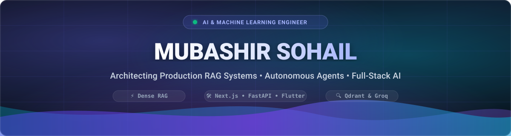

<div align="center">
  <!-- Non-clickable local SVG Banner -->
  <a href="#"></a>

  <br/><br/>

  <!-- Rotating Dynamic Typing Subtitle -->
  <a href="#">
    
  </a>

  <br/><br/>

  <p align="center">
    <strong>AI Engineer &amp; Student Researcher building RAG systems, AI agents, and intelligent software.</strong>
  </p>

<!-- Clean Contact Links -->
  <p align="center">
    <a href="https://www.linkedin.com/in/mubashir-sohail-dev">
      
    </a>
    &nbsp;
    <a href="https://mail.google.com/mail/?view=cm&fs=1&to=mubashir.sohail.dev@gmail.com" target="_blank">
      
    </a>
    &nbsp;
    <a href="https://github.com/mubashir-sohail-dev">
      
    </a>
    &nbsp;
    
  </p>
</div>

---

### 📌 Profile Overview

I am an AI Engineer and Student Researcher based in Faisalabad, Pakistan. My focus spans Retrieval-Augmented Generation (RAG), Large Language Models (LLMs), AI Agents, REST APIs, Vector Databases, and System Automation. 

I focus on building software applications that connect LLM reasoning with data pipelines, relational databases, and multi-platform user interfaces.

```yaml
engineer:
  name: Mubashir Sohail
  role: AI Engineer & Student Researcher
  location: Faisalabad, Pakistan
  core_competencies:
    - Retrieval-Augmented Generation (RAG)
    - Autonomous LLM Agents & Natural Language Interfaces
    - Full-Stack & Cross-Platform Software Development
  flagship_project: ExamCraft (Multi-platform EdTech RAG assessment engine)
  technical_interests: [Vector Retrieval Optimization, Multi-Agent Systems, MLOps]
```

---

### 🚀 Technical Evolution

```
 ┌────────────────────────┐       ┌────────────────────────┐       ┌────────────────────────┐       ┌────────────────────────┐
 │ 1. Exploratory Data    │  ───► │ 2. Data Engineering    │  ───► │ 3. GenAI, Dense RAG    │  ───► │ 4. Full-Stack RAG &    │
 │    Science & Analytics │       │    & Automation        │       │    & Vector Databases  │       │    AI Architectures    │
 └────────────────────────┘       └────────────────────────┘       └────────────────────────┘       └────────────────────────┘
   • COVID-19 EDA                   • SCD Type 2 ETL Pipeline        • OmniRAG (LangChain + OCR)      • ExamCraft Monorepo
   • Netflix Content Analytics      • Supermarket Sales Intel        • OmniQuery-AI (Text-to-SQL       (FastAPI + Next.js 15
   • Earthquake Geo-Analysis          (RFM + ANOVA Hypothesis)         + Qdrant + Self-Repair)          + Flutter + ReportLab)
```

---

### 🛠️ Technical Arsenal

| Domain | Tools & Technologies |
| :--- | :--- |
| **Languages** |      |
| **AI, LLM & RAG** |      |
| **Vector DBs & Search** |    |
| **Web & Mobile Engineering** |      |
| **Data Analytics & BI** |      |
| **Data Engineering & ETL** |    |
| **Tooling & Environments** |     |

---

### 🌟 Featured Projects

#### 🏆 [ExamCraft](https://github.com/mubashir-sohail-dev/ExamCraft) — *Textbook-Grounded RAG Assessment Studio*
> **Tech Stack:** Python, FastAPI, Qdrant Hybrid Search, Google Gemini, Next.js 15, Flutter, ReportLab

* **Problem:** Educators spend significant manual effort drafting syllabus-compliant exam papers, while raw LLMs often generate out-of-syllabus questions or distractor choices that drift from textbook material.
* **Solution:** A full-stack assessment platform featuring textbook vector retrieval, structured Pydantic schema validation, a Next.js 15 web studio for teacher review, a Flutter mobile client, and automated ReportLab vector PDF compilation.
* **Key Features:**
  * Textbook citation attribution (`chunk_id`, cited quote, and textbook reference) attached to generated questions.
  * Dual user interfaces: responsive Next.js 15 web studio and cross-platform Flutter mobile client.
  * PDF rendering producing structured A4 exam sheets and answer keys.

---

#### 🔍 [OmniQuery-AI](https://github.com/mubashir-sohail-dev/omniquery-ai) — *Natural Language to T-SQL Assistant with Self-Healing Execution*
> **Tech Stack:** Python, Qdrant Hybrid Search, FastEmbed, Groq (Llama 3.3 70B), SQL Server / PyODBC

* **Problem:** Querying large relational schemas with dozens of tables and foreign key relationships requires complex SQL joins that raw LLMs frequently misconstruct.
* **Solution:** A Text-to-SQL pipeline targeting relational database schemas (such as Microsoft AdventureWorks) using hybrid schema retrieval and an iterative SQL error-correction loop.
* **Key Features:**
  * Hybrid schema retrieval pairing dense MiniLM embeddings with sparse BM25 keyword search in Qdrant.
  * Dynamic primary/foreign key context injection for accurate multi-table JOIN creation.
  * Self-healing feedback loop that captures SQL execution errors and prompts the model to repair query syntax up to 3 retries.

---

#### 📚 [OmniRAG](https://github.com/mubashir-sohail-dev/omnirag) — *Dense Retrieval & Document Intelligence Framework*
> **Tech Stack:** Python, LangChain, ChromaDB, HuggingFace Embeddings, PyOCR / Tesseract

* **Problem:** Document QA pipelines break when processing mixed document collections containing both native text and scanned PDF pages.
* **Solution:** A modular RAG pipeline equipped with dual-mode document ingestion (native PDF parser + PyOCR fallback), persistent ChromaDB vector storage, and multi-provider LLM integrations (Google Gemini, Groq, Ollama).
* **Key Features:**
  * Automatic OCR fallback for scanned PDF documents.
  * Page-aware recursive text splitting with metadata preservation.
  * Multi-provider LLM factory enabling seamless switching between cloud and local offline models.

---

### 📂 Other Repositories & Exploratory Projects

- **[supermarket-sales-intelligence](https://github.com/mubashir-sohail-dev/supermarket-sales-intelligence)**: Retail analytics dashboard in Streamlit with RFM customer segmentation and ANOVA hypothesis testing.
- **[Student-Data-Automation](https://github.com/mubashir-sohail-dev/Student-Data-Automation)**: Python pipeline implementing Slowly Changing Dimension Type 2 (SCD2) history tracking for student records.
- **Exploratory Data Analysis Notebooks**: [Earthquake-Data-Analysis](https://github.com/mubashir-sohail-dev/Earthquake-Data-Analysis), [netflix-data-analysis](https://github.com/mubashir-sohail-dev/netflix-data-analysis), and [Covid-19-Analysis](https://github.com/mubashir-sohail-dev/Covid-19-Analysis) (Foundational pandas and matplotlib data analysis projects).

---

<div align="center">
  <!-- Non-clickable Footer Wave -->
  <a href="#"></a>
</div>
